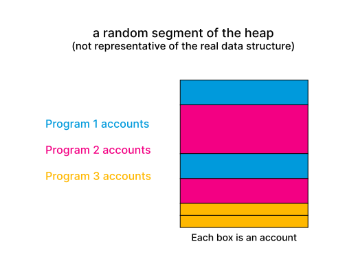
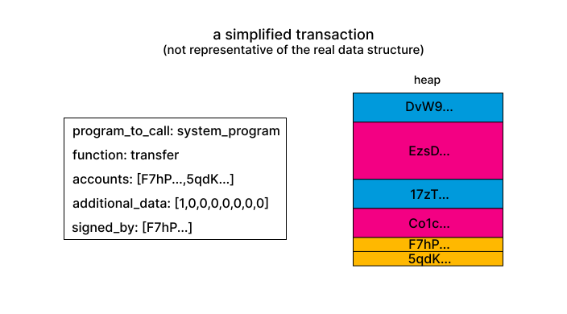
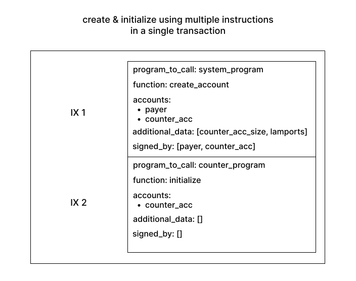

# Intro to Programming on Solana

This is a brief intro to programming on Solana that explains the most important topics.
It aims to provide everything you need to understand the following chapters in the book.

## Memory on Solana

On a high level, memory inside a Solana cluster can be thought of as a monolithic heap of data. Smart contracts on Solana ("programs" in Solana jargon) each have access to their own part of that heap.

While a program may read any part of the global heap, if a program tries to write to a part of the heap that is not theirs, the Solana runtime makes the transaction fail (there is one exception to this which is increasing the balance of an account).

All state lives in this heap. Your SOL accounts, smart contracts, and memory used by smart contracts. And each memory region has a program that manages it (sometimes called the “owner”). The solana term for a memory region is "account". Some programs own thousands of independent accounts. As shown in the figure, these accounts (even when owned by the same program) do not have to be equal in size.

<div style="text-align: center">



</div>

Since all state lives in the heap, even programs themselves live there. Accounts that store programs are owned by the `BPFLoader`. This is a program that can be used to deploy and upgrade other programs. The `BPFLoader` is owned by the `Native Loader` and that is where the recursion ends.

## Transaction and Accounts

You can make a program read and write data by sending transactions. Programs provide endpoints that can be called via transactions (In reality it's a bit more complex than that but frameworks like Anchor abstract away this complexity). A function signature usually takes the following arguments:
- the accounts that the program may read from and write to during this transaction.
- additional data specific to the function

The first point means that even if in theory the program may read and write to a large part of the global heap, in the context of a transaction, it may only read from and write to the specific regions specified in the arguments of the transaction.

> This design is partly responsible for Solana’s high throughput. The runtime can look at all the incoming transactions of a program (and even across programs) and can check whether the memory regions in the first argument of the transactions overlap. If they don’t, the runtime can run these transactions in parallel because they don’t conflict with each other. Even better, if the runtime sees that two transactions access overlapping memory regions but only read and don’t write, it can also parallelize those transactions because they do not conflict with each other.

How exactly can a transaction specify a memory region/account? To answer that, we need to look deeper into what properties an account has ([docs here](https://docs.rs/solana-program/latest/solana_program/account_info/struct.AccountInfo.html). This is the data structure for an account in a transaction. The `is_signer` and `is_writable` fields are set per transaction (e.g. `is_signed` is set if the corresponding private key of the account's `key` field signed the transaction) and are not part of the metadata that is saved in the heap). In front of the user data that the account can store (in the `data` field) , there is some metadata connected to each account. First, it has a key property which is a ed25519 public key and serves as the address of the account. This is how the transaction can specify which accounts the program may access in the transaction.

<div style="text-align: center">



</div>

An account also has a lamports field (a lamport is SOL’s smallest unit). Since all state lives in the heap, normal SOL accounts are on the heap too. They're accounts with a `data` field of length 0 (they still have metadata though!) and some amount of lamports. The System Program owns all regular SOL accounts. 

## Rent

Because validators don’t have infinite storage and providing storage costs money, accounts need to pay rent for their existence. This rent is subtracted from their lamports regularly. However, if an account's lamports balance is above the rent-exemption threshold, it is rent-exempt and does not lose its lamports. This threshold depends on the size of the account. In 99% of cases, you will create rent-exempt accounts. It's even being considered to disable non-rent-exempt accounts.

## Program Example: The System Program

Let’s now look at an example of a program: The System Program. The System Program is a smart contract with some additional privileges.

All "normal" SOL accounts are owned by the System Program. One of the system program’s responsibilities is handling transfers between the accounts it owns. This is worth repeating: Even normal SOL transfers on Solana are handled by a smart contract.

To provide transfer functionality, the system program has a “transfer” endpoint. This endpoint takes 2 accounts - from and to - and a “lamports” argument. The system program checks whether `from` signed the transaction via the `is_signer` field on the `from` account. The runtime will set this flag to `true` if the private key of the keypair that the account’s public key belongs to signed the transaction. If “from” signed the transaction, the system program removes lamports from `from`’s account and adds them to `to`’s account.

```ignore
/// simplified system program code

fn transfer(accounts, lamports) {
    if !accounts.from.is_signer {
        error();
    }
    accounts.from.lamports -= lamports;
    accounts.to.lamports += lamports;
}
```

Take a moment to guess would happen if the user passed in a `from` account that was not owned by the system program!

...

...

The transaction would fail! A program may not write to any accounts that it doesn't own. There's one exception to this rule though.
If the `to` account was owned by a different program, the transaction would still succeed. This is because programs may increase the lamports of an account even if they do not own it.

Next to transferring lamports, the system program is used to create accounts for other programs. An account is created with a specific size and a specific amount of lamports. Let's now look at program composition to see how creating accounts works in practice.

## Program Composition

There are two ways for developers to make programs interact with each other. To explain these, we'll use a common flow on Solana: Create & Initialize. 

Consider a counter program with two endpoints. One to initialize the counter and one to increment it. To create a new counter, we call the system program's `create_account` to create the account in memory and then the counter's `initialize` function.

### Program Composition via multiple instructions in a transaction

The first way to create and initialize the counter is by using multiple instructions in a transaction.
While a transaction can be used to execute a single call to a program like it was done above with `transfer`,
a single transaction can also include multiple calls to different programs.



If we went with this approach, our counter data structure would look like this:
```rust
pub struct Counter {
    pub count: u64,
    pub is_initialized: bool
}
```

and our `initialize` function would look like this:

```ignore
/// pseudo code
fn initialize(accounts) {
    let counter = deserialize(accounts.counter);
    if counter.is_initialized {
        error("already initialized");
    }
    counter.count = 0;
    counter.is_initialized = true;
}
```

This approach could also be called the "implicit" approach. This is because the programs do not explicitly communicate with each other. They are glued together by the user on the client side.

This also means that the counter needs to have an `is_initialized` variable so `initialize` can only be called once per counter account.

### Program Composition via Cross-Program Invocations

Cross-Program Invocations (CPIs) are the explicit tool to compose programs. A CPI is a direct call from one program into another within the same instruction.

Using CPIs the create & initialize flow can be executed inside the `initialize` function of the counter:

```ignore
/// pseudo code
fn initialize(accounts) {
    accounts.system_program.create_account(accounts.payer, accounts.counter);
    let counter = deserialize(accounts.counter);
    counter.count = 0;
}
```

In this example, no `is_initialized` is needed. This is because the CPI to the system program will fail if the counter exists already.

Anchor recommends CPIs to create and initialize accounts when possible (Accounts that are created by CPI can only be created with a maximum size of `10` kibibytes. This is large enough for most use cases though.). This is because creating an account inside your own instruction means that you can be certain about its properties. Any account that you don't create yourself is passed in by some other program or user that cannot be trusted. This brings us to the next section.

### Validating Inputs

On Solana it is crucial to validate program inputs. Clients pass accounts and program inputs to programs which means that malicious clients can pass malicious accounts and inputs. Programs need to be written in a way that handles those malicious inputs.

Consider the transfer function in the system program for example. It checks that `from` has signed the transaction.

```ignore
/// simplified system program code

fn transfer(accounts, lamports) {
    if !accounts.from.is_signer {
        error();
    }
    accounts.from.lamports -= lamports;
    accounts.to.lamports += lamports;
}
```

If it didn't do that, anyone could call the endpoint with your account and make the system program transfer the lamports from your account into theirs.

The book will eventually have a chapter explaining all the different types of attacks and how anchor prevents them but for now here's one more example. Consider the counter program from earlier. Now imagine that next to the counter struct, there's another struct that is a singleton which is used to count how many counters there are.

```rust,ignore
struct CounterCounter {
    count: u64
}
```

Every time a new counter is created, the `count` variable of the counter counter should be incremented by one.

Consider the following `increment` instruction that increases the value of a counter account:

```ignore
/// pseudo code
fn increment(accounts) {
    let counter = deserialize(accounts.counter);
    counter.count += 1;
}
```

This function is insecure. But why? It's not possible to pass in an account owned by a different program because the function writes to the account so the runtime would make the transaction fail. But it is possible to pass in the counter counter singleton account because both the counter and the counter counter struct have the same structure (they're a rust struct with a single `u64` variable). This would then increase the counter counter's count and it would no longer track how many counters there are.

The fix is simple:

```ignore
/// pseudo code

// a better approach than hardcoding the address is using a PDA.
// We will cover those later in the book.
let HARDCODED_COUNTER_COUNTER_ADDRESS = SOME_ADDRESS;

fn increment(accounts) {
    if accounts.counter.key == HARDCODED_COUNTER_COUNTER_ADDRESS {
        error("Wrong account type");
    }
    let counter = deserialize(accounts.counter);
    counter.count += 1;
}
```

There are many types of attacks possible on Solana that all revolve around passing in one account where another was expected but it wasn't checked that the actual one is really the expected one. This brings us from Solana to Anchor. A big part of Anchor's raison d'être is making input validation easier or even doing it for you when possible (e.g. with idiomatic anchor, this account type confusion cannot happen thanks to anchor's discriminator which we'll cover later in the book).

Let's dive in.
